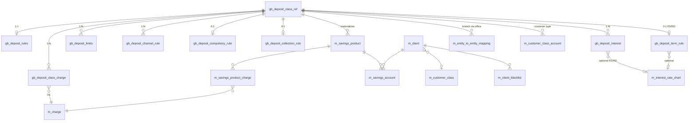

# Deposit Class Reference — architecture & implementation plan

Micropay extends Apache Fineract deposit products (Savings, Fixed Deposit, Recurring Deposit) with a **Deposit Class Reference** layer: reusable product templates that define charges, rules, interest, eligibility, and MFI-specific operational constraints. Products (`m_savings_product`) **materialize** from a deposit class at creation time and retain a foreign key for traceability.

This document covers:

1. What Fineract and Micropay already provide
2. Gaps in the original deposit-class proposal
3. MFI-level requirements missing from both Fineract and the initial spec
4. Consolidated data model (ER diagram)
5. Phased delivery and enforcement strategy

---

## Key concepts

| Term | Meaning |
|------|---------|
| **Deposit class** | Master template (`gb_deposit_class_ref` + child tables). Defines how a category of deposit behaves. |
| **Deposit product** | Fineract `m_savings_product` row (savings / FD / RD via `deposit_type_enum`). Client-facing offering created from a class. |
| **Materialization** | Copying class configuration onto a product at create time (recommended default). |
| **Enforcement point** | Code path that validates rules (account opening, deposit, withdrawal, interest posting, etc.). |

**Design decision (recommended):** **Snapshot on product create.** Class changes do not retroactively alter live products. New products pick up the latest effective class version. Optional future enhancement: explicit “sync product from class” command.

---

## Current state — Fineract core

All deposit types share single-table inheritance:

| Type | `deposit_type_enum` | Product entity | API base |
|------|---------------------|----------------|----------|
| Savings | 100 | `SavingsProduct` | `/v1/savingsproducts` |
| Fixed Deposit | 200 | `FixedDepositProduct` | `/v1/fixeddepositproducts` |
| Recurring Deposit | 300 | `RecurringDepositProduct` | `/v1/recurringdepositproducts` |
| Current (enum only) | 400 | — | Not implemented |

**Core tables:** `m_savings_product`, `m_savings_account`, `m_savings_product_charge`, `m_savings_account_charge`, `m_savings_account_transaction`.

### Features already in place (operational — not part of deposit class)

These exist in Fineract and should be **referenced or enforced**, not redefined in the deposit class schema:

| Capability | Status | Key locations |
|------------|--------|---------------|
| Product charges (M2M to `m_charge`) | Implemented | `m_savings_product_charge`, `SavingsProduct.charges` |
| Flat savings interest + enums | Implemented | `nominal_annual_interest_rate`, compounding/posting/calculation enums on product |
| FD/RD term & pre-closure rules | Implemented | `m_deposit_product_term_and_preclosure`, `DepositProductTermAndPreClosure` |
| FD/RD interest rate charts | Implemented | `m_interest_rate_chart`, `m_interest_rate_slab`, `m_deposit_product_interest_rate_chart` |
| RD mandatory schedule | Implemented | `m_deposit_product_recurring_detail`, `m_mandatory_savings_schedule` |
| Dormancy → inactive → dormant → escheat | Implemented | `SavingsAccountSubStatusEnum`, `UpdateSavingsDormantAccountsTasklet` |
| Account block / freeze (full, credit, debit) | Implemented | Savings account commands, sub-status enums |
| Lien / amount hold | Implemented | `AMOUNT_HOLD` transactions, `lien_allowed` on product |
| Overdraft (savings) | Implemented | `allow_overdraft`, `overdraft_limit`, overdraft interest rate |
| Tax withholding | Implemented | `withhold_tax`, `tax_group_id` |
| GL product mapping | Implemented | `acc_product_mapping`, savings accounting APIs |
| Standing instructions | Implemented | `StandingInstructionApiResource`, execute job |
| Loan ↔ savings link + SI at disbursement | Partial | `AccountAssociations`, optional SI on disbursement |
| Center / group collection sheet | Implemented | `CollectionSheetApiResource`, mandatory RD deposits |
| GSIM (group individual savings) | Implemented | `GroupSavingsIndividualMonitoring`, `gsim_accounts` |
| Share accounts (generic) | Partial | `fineract-provider/.../shareaccounts/` |
| SMS / notifications on savings events | Implemented | `SmsCampaignDomainServiceImpl`, `NotificationDomainServiceImpl` |
| Transaction search / Pentaho reports | Partial | Savings transaction APIs; Client Saving Transactions report |
| Interest to linked internal savings (FD/RD) | Partial | `TransferInterestToSavingsTasklet` |

### Gaps in Fineract core (relevant to deposit products)

| Gap | Notes |
|-----|-------|
| No reusable product template / class layer | Products are self-contained |
| Max balance, withdrawal/deposit limits | Not on product |
| Cycle-based transaction caps | Not enforced |
| Debit interest (non-overdraft) | Not modeled |
| Cheque facility on deposits | Not implemented |
| Branch mapping for FD/RD products | Office mapping wired for savings only |
| Joint holders / nominee on savings | Not implemented |
| KYC-tier limits at transaction time | Not enforced on savings writes |
| Channel / payment-type restrictions per product | Not implemented |
| Compulsory savings on plain savings (loan-linked) | Only RD mandatory flag + optional SI |
| Passbook workflow | Reports only |
| External interest payout | Internal linked account only |
| Product effective/expiry dates | Not on product |
| Maker-checker on product definition | Standard command pattern only |

---

## Current state — Micropay extensions

Micropay adds client segmentation and operational schema that **partially overlaps** deposit class goals but is **not wired into savings transaction paths**:

| Artifact | Status | Path / migration |
|----------|--------|------------------|
| Customer class master | Implemented (API) | `m_customer_class`, `/v1/customerclasses`, `V3004__...sql` |
| Customer class → product mapping | **Schema only** | `m_customer_class_account` — no Java entity or validation at account opening |
| Client blacklist with deposit blocks | **Schema only** | `m_client_blacklist.block_deposits`, `block_withdrawals`, `block_digital_channels` |
| Channel master (limits, OTP) | **Schema only** | `m_channel`, `V3003__add_micropay_campaign_channel_tables.sql` |
| Office → savings product access | Partial | `m_entity_to_entity_mapping`, relation `office_access_to_savings_products` — savings products only |
| Minor client type code value | Partial | Seeded; no savings-specific rules |
| Share purchase from savings | Implemented | `3086_add_share_transaction_use_savings.xml` |
| Structured account numbers | Implemented | See `docs/prompts/structured-account-number-ui-agent-prompt.md` |

**Phase 1 priority:** Wire existing Micropay schema into account opening and transaction validation before adding large new table sets.

---

## Original deposit-class proposal — assessment

Team-provided tables:

- `gb_deposit_class_ref` — master class
- `gb_deposit_charge` — fees linked to class
- `gb_deposit_rules` — operational boundaries
- `gb_deposit_interest` — interest configuration

### Strengths

- Modular 1:N design (class → charges, rules, interest)
- Lifecycle dates and audit trail on class
- Separates product identity from behavioral config

### Issues to resolve in implementation

| Issue | Resolution |
|-------|------------|
| Duplicate fields on class ref and rules (min/max balance, dormancy, overdraft) | **Rules table is source of truth** for limits; class ref holds identity + flags only |
| `charge_code` / single charge on class ref | Remove from class ref; use `gb_deposit_class_charge` → `m_charge` |
| `gl_account VARCHAR(30)` | Use `acc_product_mapping` at product materialization; optional class-level GL template table in Phase 2 |
| `gb_deposit_charge.charge_id` naming collision | Rename link table; FK to `m_charge.id` |
| Manual BIGINT PKs | Use `GENERATED ALWAYS AS IDENTITY` (Micropay convention) |
| `created_by VARCHAR(50)` | FK to `m_appuser(id)` |
| `account_type VARCHAR(30)` | Map to `deposit_type_enum SMALLINT` |
| Single `interest_rate` | Insufficient for FD/RD; support chart/slabs or link to `m_interest_rate_chart` |
| `calculation_method VARCHAR` | Split into Fineract enums (calculation, compounding, posting, days-in-year) |
| Branch / customer mapping in verbal spec | Use existing `m_entity_to_entity_mapping` + `m_customer_class_account` |
| Cheque rules in verbal spec | Deferred to Phase 3 (lower MFI priority than channel/compulsory savings) |

---

## MFI gaps — not in Fineract or original spec

These are included in the consolidated model below:

| # | Requirement | Phase |
|---|-------------|-------|
| 1 | Loan-linked compulsory savings (% of loan / fixed / hold until event) | 2 |
| 2 | KYC / tier transaction limits (balance, daily/monthly caps) | 1 |
| 3 | Channel & payment-type restrictions | 1 |
| 4 | Blacklist enforcement on deposit writes | 1 |
| 5 | Customer class → product eligibility at account opening | 1 |
| 6 | Voluntary vs compulsory product flag (beyond RD) | 2 |
| 7 | Collection sheet eligibility + deposit multiples | 2 |
| 8 | Lock-in period / early withdrawal penalty template | 2 |
| 9 | Lien rules (max lien %) on product class | 2 |
| 10 | Max accounts per client per class | 2 |
| 11 | RD/FD lifecycle (auto-renew, missed installment penalty) | 2 |
| 12 | Nominee / joint holders | 3 |
| 13 | Passbook workflow | 3 |
| 14 | External interest payout destination | 3 |
| 15 | Deposit insurance / insured balance cap | 3 |
| 16 | Islamic / profit-sharing products | 3 |
| 17 | SACCO BOSA/FOSA semantics | 3 |
| 18 | Escheat regulatory remittance workflow | 3 |
| 19 | Regulator-specific deposit returns | 3 |
| 20 | Cheque facility rules | 3 |

---

## Consolidated entity model

### ER diagram



### Table summary by phase

#### Phase 1 — Foundation + enforcement wiring

| Table | Purpose | Maps from original spec |
|-------|---------|-------------------------|
| `gb_deposit_class_ref` | Master template: code, name, type, currency, status, flags, lifecycle, audit | Yes (trimmed) |
| `gb_deposit_rules` | Balance & transaction limits, dormancy days, opening balance, multiples | Yes (expanded) |
| `gb_deposit_interest` | Credit/debit interest rows with Fineract enums + effective dates | Yes (expanded) |
| `gb_deposit_class_charge` | Class ↔ `m_charge` link with effective dates | Yes (renamed from `gb_deposit_charge`) |
| `gb_deposit_limits` | KYC/tier/cycle caps (daily/monthly deposit & withdrawal, max balance) | **New (MFI)** |
| `gb_deposit_channel_rule` | Allowed channels, payment types, per-channel caps | **New (MFI)** |
| `m_savings_product.deposit_class_id` | FK traceability | **New** |

**Wire existing (no new tables):**

| Existing table | Action |
|----------------|--------|
| `m_customer_class_account` | JPA entity + validate at account opening |
| `m_client_blacklist` | Check flags in savings write services |
| `m_channel` | Channel API + validate on self-service / channel-tagged transactions |
| `m_entity_to_entity_mapping` | Extend FD/RD product create/read to use `office_access_to_savings_products` |

#### Phase 2 — MFI product behavior

| Table | Purpose |
|-------|---------|
| `gb_deposit_compulsory_rule` | Loan-linked compulsory savings (%, fixed, hold/release trigger, scoped loan products) |
| `gb_deposit_collection_rule` | Collection sheet eligible, `in_multiples_of`, meeting-frequency hint |
| `gb_deposit_term_rule` | FD/RD: min/max term, amounts, pre-closure penalty, auto-renew, missed RD penalty |
| `gb_deposit_class_ref.is_compulsory` | Voluntary vs compulsory dimension for reporting |
| `gb_deposit_class_ref.is_collection_sheet_eligible` | Field collection flag |

**Extend Fineract product materialization** to populate `DepositProductTermAndPreClosure`, recurring detail, and interest charts from `gb_deposit_term_rule` / `gb_deposit_interest`.

#### Phase 3 — Extended banking & regulatory

| Table / module | Purpose |
|----------------|---------|
| `gb_deposit_cheque_rules` | Cheque book, limits, bounce/stop charges |
| `gb_deposit_nominee` (account-level) | Nominee name, relationship, share % |
| `gb_deposit_joint_holder` (account-level) | Joint account holders |
| `gb_deposit_insurance_rule` | Insured balance cap, DICGC-style reporting |
| `gb_deposit_payout_rule` | External interest payout (mobile money / bank) |
| Passbook module | Passbook lines, reissue, reconciliation |
| Escheat remittance tracking | Regulatory unclaimed-property workflow |
| Islamic product type | Profit-sharing calculation cycle |

---

## Proposed Phase 1 DDL (reference)

PostgreSQL style; MySQL twin follows Micropay migration convention (`V3088__...sql` + `.mysql.sql`).

```sql
CREATE TABLE gb_deposit_class_ref (
    id BIGINT GENERATED ALWAYS AS IDENTITY PRIMARY KEY,
    class_code VARCHAR(30) NOT NULL UNIQUE,
    class_name VARCHAR(100) NOT NULL,
    description VARCHAR(255),
    deposit_type_enum SMALLINT NOT NULL,
    currency_code VARCHAR(3) NOT NULL,
    status VARCHAR(20) NOT NULL DEFAULT 'ACTIVE',
    interest_bearing BOOLEAN NOT NULL DEFAULT true,
    overdraft_allowed BOOLEAN NOT NULL DEFAULT false,
    charges_apply BOOLEAN NOT NULL DEFAULT false,
    tax_applicable BOOLEAN NOT NULL DEFAULT false,
    daily_transaction_rules_apply BOOLEAN NOT NULL DEFAULT false,
    channel_restrictions_apply BOOLEAN NOT NULL DEFAULT false,
    effective_date DATE,
    expiry_date DATE,
    created_by BIGINT NOT NULL,
    created_on_utc TIMESTAMP WITH TIME ZONE NOT NULL,
    last_modified_by BIGINT NOT NULL,
    last_modified_on_utc TIMESTAMP WITH TIME ZONE NOT NULL,
    approved_by BIGINT,
    approved_on_utc TIMESTAMP WITH TIME ZONE,
    version BIGINT NOT NULL DEFAULT 1
);

CREATE TABLE gb_deposit_rules (
    id BIGINT GENERATED ALWAYS AS IDENTITY PRIMARY KEY,
    deposit_class_id BIGINT NOT NULL UNIQUE REFERENCES gb_deposit_class_ref(id),
    min_required_opening_balance NUMERIC(19,6),
    min_required_balance NUMERIC(19,6),
    max_balance NUMERIC(19,6),
    withdrawal_limit NUMERIC(19,6),
    deposit_limit NUMERIC(19,6),
    daily_transaction_limit NUMERIC(19,6),
    max_deposits_per_cycle NUMERIC(19,6),
    max_withdrawals_per_cycle NUMERIC(19,6),
    min_deposit_amount NUMERIC(19,6),
    in_multiples_of NUMERIC(19,6),
    overdraft_allowed BOOLEAN NOT NULL DEFAULT false,
    overdraft_limit NUMERIC(19,6),
    enforce_min_required_balance BOOLEAN NOT NULL DEFAULT false,
    lien_allowed BOOLEAN NOT NULL DEFAULT false,
    max_lien_limit NUMERIC(19,6),
    lockin_period_frequency NUMERIC(19,6),
    lockin_period_frequency_enum SMALLINT,
    days_to_inactive INT,
    days_to_dormancy INT,
    days_to_escheat INT,
    is_dormancy_tracking_active BOOLEAN NOT NULL DEFAULT false,
    penalty_code VARCHAR(30)
);

CREATE TABLE gb_deposit_interest (
    id BIGINT GENERATED ALWAYS AS IDENTITY PRIMARY KEY,
    deposit_class_id BIGINT NOT NULL REFERENCES gb_deposit_class_ref(id),
    interest_direction VARCHAR(2) NOT NULL CHECK (interest_direction IN ('CR','DR')),
    annual_interest_rate NUMERIC(19,6),
    interest_calculation_type_enum SMALLINT,
    interest_compounding_period_enum SMALLINT,
    interest_posting_period_enum SMALLINT,
    interest_calculation_days_in_year_type_enum SMALLINT,
    min_balance_for_interest_calculation NUMERIC(19,6),
    accrual_balance_type VARCHAR(30),
    settlement_mode VARCHAR(20),
    tax_applicable BOOLEAN NOT NULL DEFAULT false,
    tax_group_id BIGINT REFERENCES m_tax_group(id),
    interest_rate_chart_id BIGINT REFERENCES m_interest_rate_chart(id),
    effective_date DATE NOT NULL,
    expiry_date DATE
);

CREATE TABLE gb_deposit_class_charge (
    id BIGINT GENERATED ALWAYS AS IDENTITY PRIMARY KEY,
    deposit_class_id BIGINT NOT NULL REFERENCES gb_deposit_class_ref(id),
    charge_id BIGINT NOT NULL REFERENCES m_charge(id),
    effective_date DATE,
    expiry_date DATE,
    UNIQUE (deposit_class_id, charge_id, effective_date)
);

CREATE TABLE gb_deposit_limits (
    id BIGINT GENERATED ALWAYS AS IDENTITY PRIMARY KEY,
    deposit_class_id BIGINT NOT NULL REFERENCES gb_deposit_class_ref(id),
    limit_type VARCHAR(30) NOT NULL,
    period_type VARCHAR(20),
    max_amount NUMERIC(19,6),
    customer_class_id BIGINT REFERENCES m_customer_class(id),
    effective_date DATE,
    expiry_date DATE
);

CREATE TABLE gb_deposit_channel_rule (
    id BIGINT GENERATED ALWAYS AS IDENTITY PRIMARY KEY,
    deposit_class_id BIGINT NOT NULL REFERENCES gb_deposit_class_ref(id),
    channel_id BIGINT REFERENCES m_channel(id),
    payment_type_id BIGINT,
    allowed BOOLEAN NOT NULL DEFAULT true,
    max_amount_per_txn NUMERIC(19,6),
    max_amount_per_day NUMERIC(19,6),
    effective_date DATE,
    expiry_date DATE
);

ALTER TABLE m_savings_product
    ADD COLUMN deposit_class_id BIGINT REFERENCES gb_deposit_class_ref(id);
```

---

## Column mapping — original spec → consolidated model

### `gb_deposit_class_ref`

| Original column | Consolidated handling |
|-----------------|---------------------|
| `deposit_class_id` | `id` (identity) |
| `class_code`, `deposit_class_name`, `description` | Unchanged semantically |
| `row_version` | `version` |
| `account_type` | `deposit_type_enum` |
| `currency_code` | `VARCHAR(3)` |
| `status` | Unchanged |
| `minimum_balance`, `maximum_balance`, `withdrawal_limit`, `deposit_limit` | Moved to `gb_deposit_rules` |
| `interest_bearing`, `credit/debit rates` | Flag on class; rates in `gb_deposit_interest` |
| `overdraft_allowed` | Flag on class + detail in `gb_deposit_rules` |
| `dormancy_period`, `dormancy_trm` | `days_to_*` in `gb_deposit_rules` (days, not months) |
| `charges_apply`, `tax_applicable`, `daily_transaction_apply`, `channel_apply` | Boolean flags on class |
| `charge_code`, `gl_account` | Removed — charges via join table; GL via `acc_product_mapping` at materialization |
| Audit columns | Micropay pattern (`BIGINT` user FKs, UTC timestamps) |

### `gb_deposit_charge` → `gb_deposit_class_charge`

| Original column | Consolidated handling |
|-----------------|---------------------|
| `charge_id` (PK) | `id` (identity) on link row |
| `charge_code`, `charge_type`, `amount_percentage`, `value`, `frequency` | **Dropped** — reuse `m_charge` master |
| `deposit_class_id`, effective/expiry | Retained on link table |

### `gb_deposit_rules`

| Original column | Consolidated handling |
|-----------------|---------------------|
| All limit/dormancy/overdraft columns | Retained + opening balance, cycle caps, lien, lock-in |
| `transaction_limit` | `daily_transaction_limit` + `gb_deposit_limits` for tier/channel |

### `gb_deposit_interest`

| Original column | Consolidated handling |
|-----------------|---------------------|
| `debit_credit_interest` | `interest_direction` (`CR` / `DR`) |
| `interest_rate` | `annual_interest_rate` (+ chart FK for FD/RD) |
| `calculation_method` | Four Fineract enum columns |
| Missing accrual/settlement fields | `accrual_balance_type`, `settlement_mode` |

---

## Product materialization flow

When an operator creates a savings / FD / RD product from a deposit class:

```
┌──────────────────────┐
│ POST /v1/depositclasses│  (maintain templates)
└──────────┬───────────┘
           │
           v
┌──────────────────────┐     ┌─────────────────────────┐
│ Select deposit class │────>│ Validate effective date │
│ + product name       │     │ + status ACTIVE         │
└──────────┬───────────┘     └─────────────────────────┘
           │
           v
┌──────────────────────────────────────────────────────────┐
│ DepositClassProductAssembler.materialize()               │
│  • Map gb_deposit_rules → SavingsProduct fields            │
│  • Map gb_deposit_interest (CR) → rate + enums           │
│  • Map gb_deposit_interest (DR) → overdraft rate         │
│  • Copy gb_deposit_class_charge → m_savings_product_charge │
│  • FD/RD: gb_deposit_term_rule → term/preclosure/recurring│
│  • FD/RD: link or clone interest_rate_chart                │
│  • Set m_savings_product.deposit_class_id                  │
│  • Create acc_product_mapping from institution defaults    │
└──────────┬───────────────────────────────────────────────┘
           │
           v
┌──────────────────────┐
│ Existing product APIs│  /v1/savingsproducts, /fixeddepositproducts, etc.
└──────────────────────┘
```

Accounts continue to be opened against **products**. Runtime enforcement reads product fields plus class-linked rules where not denormalized.

---

## Enforcement map

| Rule source | Account opening | Deposit | Withdrawal | Interest job | Collection sheet |
|-------------|-----------------|--------|------------|--------------|------------------|
| `m_customer_class_account` | **Validate** | — | — | — | — |
| `m_client_blacklist` | **Validate** | **Validate** | **Validate** | — | — |
| `gb_deposit_rules` (via product) | Min opening balance | Min amount, multiples | Limits, min balance | Dormancy flags | — |
| `gb_deposit_limits` | Max accounts | Daily/monthly caps | Daily/monthly caps | — | — |
| `gb_deposit_channel_rule` + `m_channel` | — | **Validate** | **Validate** | — | Branch/channel |
| `gb_deposit_compulsory_rule` | — | Loan event hook | Hold/release | — | — |
| `gb_deposit_collection_rule` | — | — | — | — | Eligibility |
| `m_entity_to_entity_mapping` | Office product list | — | — | — | — |
| Fineract dormancy job | — | — | — | Status transition | — |
| Fineract block/freeze | — | **Validate** | **Validate** | — | — |

**Implementation note:** Centralize validation in a `DepositRuleValidationService` called from:

- `DepositApplicationProcessWritePlatformServiceJpaRepositoryImpl` (account open)
- `SavingsAccountDomainServiceJpa` / `DepositAccountDomainServiceJpa` (transactions)
- Self-service savings endpoints (channel-aware)

---

## Planned API surface

Base: `/v1/depositclasses`

| Method | Path | Permission (proposed) | Phase |
|--------|------|----------------------|-------|
| GET | `/depositclasses` | `READ_DEPOSITCLASS` | 1 |
| GET | `/depositclasses/{id}` | `READ_DEPOSITCLASS` | 1 |
| POST | `/depositclasses` | `CREATE_DEPOSITCLASS` | 1 |
| PUT | `/depositclasses/{id}` | `UPDATE_DEPOSITCLASS` | 1 |
| POST | `/depositclasses/{id}?command=approve` | `APPROVE_DEPOSITCLASS` | 1 |
| POST | `/depositclasses/{id}?command=materializeProduct` | `CREATE_SAVINGSPRODUCT` / deposit product perms | 1 |

Nested resources (charges, rules, interest, limits, channel rules) can be embedded in create/update JSON initially; split sub-resources if payloads grow.

**Extend existing APIs:**

| API | Change | Phase |
|-----|--------|-------|
| `POST /v1/savingsproducts` (and FD/RD) | Optional `depositClassId` — triggers materialization | 1 |
| `POST /v1/customerclasses/{id}/products` | CRUD for `m_customer_class_account` | 1 |
| `POST /v1/channels` | CRUD for `m_channel` if not present | 1 |

---

## Delivery phases — summary

### Phase 1 — Foundation (weeks 1–4)

**Goal:** Deposit class CRUD, product materialization, wire Micropay enforcement.

| Work item | Deliverable |
|-----------|-------------|
| Liquibase migrations | Phase 1 tables + `m_savings_product.deposit_class_id` |
| Domain + API | `DepositClass`, services, `/v1/depositclasses` |
| Materialization | `DepositClassProductAssembler` for savings; basic FD/RD |
| Customer class → product | Entity + service + account opening validation |
| Blacklist enforcement | Checks in savings write path |
| Channel rules | Channel CRUD + transaction validation (self-service first) |
| Branch mapping | FD/RD product office mapping parity with savings |
| Permissions | `READ/CREATE/UPDATE/APPROVE_DEPOSITCLASS` |

### Phase 2 — MFI behavior (weeks 5–8)

**Goal:** Field operations and credit-linkage.

| Work item | Deliverable |
|-----------|-------------|
| `gb_deposit_compulsory_rule` | Loan disbursement / approval hooks |
| `gb_deposit_collection_rule` | Collection sheet gating + multiples |
| `gb_deposit_term_rule` | Full FD/RD materialization including charts |
| Compulsory / voluntary flags | Reporting dimension |
| RD missed installment penalties | Term rule → schedule job integration |
| FD auto-renew on maturity | Term rule + maturity job |

### Phase 3 — Extended (weeks 9+)

**Goal:** Regulatory, lifecycle, and market-specific.

| Work item | Deliverable |
|-----------|-------------|
| Nominee / joint holders | Account-level entities + APIs |
| Passbook module | Print/reconcile workflow |
| External interest payout | Payout rule + payment rail integration |
| Cheque rules | `gb_deposit_cheque_rules` |
| Deposit insurance caps | Limits + reporting |
| Escheat remittance | Workflow beyond sub-status |
| Islamic / SACCO variants | Separate product type or class flags |

---

## What we are not changing

- Existing account transaction model (`m_savings_account_transaction`)
- Fineract charge master (`m_charge`) — classes reference charges, not duplicate them
- COB / interest posting job architecture — products remain the runtime source for posted interest
- Loan module structure — compulsory savings added as integration hooks only

---

## Related documentation

| Document | Relevance |
|----------|-----------|
| [`inter-branch-servicing.md`](../micropay/inter-branch-servicing.md) | Cross-branch deposits — channel rules must align with `transaction_office_id` |
| [`job-sequences.md`](job-sequences.md) | EOD: dormancy job, savings interest posting, RD schedule generation |
| [`eod-business-date-runbook.md`](eod-business-date-runbook.md) | Operational scheduling |
| [`structured-account-number-ui-agent-prompt.md`](../prompts/structured-account-number-ui-agent-prompt.md) | Account numbering on product open |

---

## Open decisions (for team sign-off)

1. **Snapshot vs live inheritance** — recommend snapshot; confirm.
2. **Current account (`deposit_type_enum = 400`)** — in scope for Phase 1 or defer?
3. **Maker-checker on class approve** — use workflow engine or simple `approved_by` command?
4. **Cheque module priority** — confirm Phase 3 vs required for launch.
5. **Interest chart ownership** — clone chart on materialize vs shared chart reference?

---

## Revision history

| Date | Author | Notes |
|------|--------|-------|
| 2026-08-01 | Micropay architecture | Initial consolidated deposit class reference plan |
