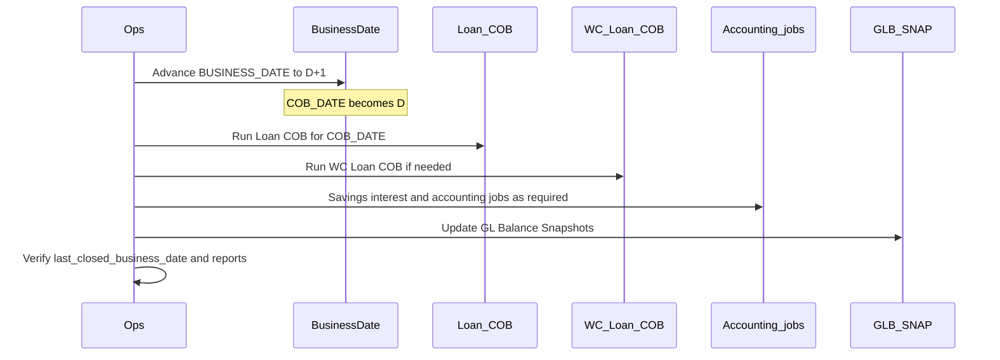

# End-of-day / next business date runbook

Operational guide for Micropay CBS (Fineract) to close business day **D** and open **D+1**.

There is **no hard-coded single EOD job**. Ops can use **configurable job sequences** (named ordered lists of jobs/operations) via `/v1/jobsequences` — see [`job-sequences.md`](job-sequences.md). Date advance, Loan COB, Working Capital Loan COB, savings jobs, and GL snapshots remain **independent** jobs; the default seeded sequence `END_OF_DAY` chains them when executed.

Upstream concepts: `fineract-doc/src/docs/en/chapters/architecture/business-date.adoc`.  
Micropay GL snapshots: [`gl-balance-snapshot-design.md`](gl-balance-snapshot-design.md).
Job sequences: [`job-sequences.md`](job-sequences.md).

## Model

| Concept | Storage | Meaning |
|---------|---------|---------|
| `BUSINESS_DATE` | `m_business_date` type `BUSINESS_DATE` | Logical day for live posting |
| `COB_DATE` | `m_business_date` type `COB_DATE` | Day being closed by COB jobs |

### Configs

| Config | Recommendation |
|--------|----------------|
| `enable-business-date` | **Enabled** |
| `enable-automatic-cob-date-adjustment` | **Enabled** — when `BUSINESS_DATE` is set to D+1, `COB_DATE` becomes D |

### Intended split after advance

- New user traffic posts with **BUSINESS_DATE = D+1**
- Loan / WC COB process **COB_DATE = D**
- Micropay `Update GL Balance Snapshots` aggregates through **businessDate − 1** (= D when business date is D+1)

## Ordered checklist (D finished → open D+1)

### 1. Prerequisites

- Confirm `enable-business-date` is on.
- Prefer `enable-automatic-cob-date-adjustment` on.
- Confirm COB step configuration:
  - `GET /v1/jobs/LOAN_CLOSE_OF_BUSINESS/steps`
  - `GET /v1/jobs/WORKING_CAPITAL_LOAN_CLOSE_OF_BUSINESS/steps` (if WC loans are used)
- Ensure required jobs exist and can be executed (Admin → Scheduler, or job execute API). Many are seeded **inactive**.

### 2. Operational cutover

- Stop or limit new transactions that should still belong to day **D** (teller cutoff, channel freeze, etc.).
- This is a **process control**, not enforced by Fineract code.

### 3. Advance business date

**Preferred:** with auto-COB adjustment enabled:

- `POST /v1/businessdate` with `type=BUSINESS_DATE` and date **D+1**,  
  **or** run job **Increase Business Date by 1 day** (`INCREASE_BUSINESS_DATE_BY_1_DAY`).

**Verify:**

- `BUSINESS_DATE` = D+1
- `COB_DATE` = D

If auto-COB adjustment is **off**, also set COB date (API or job **Increase COB Date by 1 day**) so COB targets D.

Do **not** advance business date while you still need new customer postings accounted on D. The intended model is: advance first, then COB closes D while live traffic uses D+1.

### 4. Close portfolio for COB_DATE (D)

| Step | Job / API | When |
|------|-----------|------|
| Loan close of business | Job **Loan COB** (`LOAN_COB` / workflow `LOAN_CLOSE_OF_BUSINESS`) | Always when loans exist |
| Loan catch-up | `GET /v1/loans/is-catch-up-running`, `POST /v1/loans/catch-up` | If loans lag behind COB date |
| Working capital | Job **Working Capital Loan COB** (`WORKING_CAPITAL_LOAN_COB_JOB` / `WORKING_CAPITAL_LOAN_CLOSE_OF_BUSINESS`) | When WC loans exist |

**Verify:**

- No stuck loan COB locks
- Sample loans show `last_closed_business_date` = D

Loan COB and WC Loan COB are **domain step orchestrators** (arrears, accruals, delinquency, etc.). They do **not** advance the business date and do **not** run GL snapshots.

### 5. Savings / deposits (product-dependent)

Not chained to Loan COB. Run as your product schedule requires, for example:

- **Post Interest For Savings** (`POST_INTEREST_FOR_SAVINGS`)
- Other savings/deposit due / dormancy / standing-instruction jobs your deployment enables

Savings COB scaffolding (`SAVINGS_CLOSE_OF_BUSINESS`) exists in code but is **not** a complete bank-wide EOD job in this stack.

### 6. Accounting and Micropay GL snapshots

Run after COB journal activity for D is complete:

| Job | Display name | Notes |
|-----|--------------|-------|
| `JOURNAL_ENTRY_AGGREGATION` | Journal Entry Aggregation | If used |
| `UPDATE_TRIAL_BALANCE_DETAILS` | Update Trial Balance Details | If used |
| `RETAINED_EARNING` | Retained Earning Job | Period-end / if used |
| `UPDATE_GL_BALANCE_SNAPSHOTS` | Update GL Balance Snapshots | Short name `GLB_SNAP` — targets through `businessDate − 1` |

Use **GL Balance Snapshot Backfill** (`GLB_BBFL`) only for historical rebuilds, not daily EOD.

### 7. Housekeeping (optional)

- Purge external events / processed commands (if enabled in your deployment)
- Do not treat archiving as a daily EOD step; see [`gl-balance-snapshot-archive-contract.md`](gl-balance-snapshot-archive-contract.md)

### 8. Confirm ready for D+1

- APIs and UI use `BUSINESS_DATE` = D+1
- Next day advance will make `COB_DATE` = D+1 for the following close

## Job reference

### Date advance

| Job enum | Display name | Role |
|----------|--------------|------|
| `INCREASE_BUSINESS_DATE_BY_1_DAY` | Increase Business Date by 1 day | Advances `BUSINESS_DATE` by 1; may auto-set `COB_DATE` |
| `INCREASE_COB_DATE_BY_1_DAY` | Increase COB Date by 1 day | Use when auto-COB adjustment is off |

API alternatives: `GET/POST /v1/businessdate`, `GET /v1/businessdate/{type}`.  
Permissions: `READ_BUSINESS_DATE`, `UPDATE_BUSINESS_DATE`.

### Portfolio COB

| Job enum | Workflow / name | Role |
|----------|-----------------|------|
| `LOAN_COB` | `LOAN_CLOSE_OF_BUSINESS` | Loan step workflow for `COB_DATE` |
| `WORKING_CAPITAL_LOAN_COB_JOB` | `WORKING_CAPITAL_LOAN_CLOSE_OF_BUSINESS` | WC loan step workflow |

Configure steps via `GET/PUT /v1/jobs/{jobName}/steps`.

### Micropay accounting snapshots

| Job enum | Short name | Role |
|----------|------------|------|
| `UPDATE_GL_BALANCE_SNAPSHOTS` | `GLB_SNAP` | Incremental daily/monthly snapshots |
| `GL_BALANCE_SNAPSHOT_BACKFILL` | `GLB_BBFL` | Historical backfill only |

## Verification

1. **Dates**
   - `GET /v1/businessdate` → `BUSINESS_DATE` = D+1, `COB_DATE` = D (after advance, before next advance)
2. **Loan COB**
   - Job completed successfully
   - Sample active loans: `last_closed_business_date` = D
3. **GL snapshots** (after `GLB_SNAP`)
   - `m_gl_balance_snapshot_tracking.snapshot_date_to` ≥ D (or through expected watermark)
   - Spot-check Balance Sheet / Trial Balance / GL report for D vs D+1
4. **Reports**
   - Period reports for D should include COB-generated entries for D
   - New postings after advance should appear on D+1

## Gaps (do not assume)

| Gap | Implication |
|-----|-------------|
| Sequences are user-triggered (v1) | Use `/v1/jobsequences/{id}?command=execute` or an external scheduler calling that API; no cron on the sequence itself yet |
| No pre-flight gate on date advance | System does not block advance if COB incomplete |
| Jobs often seeded inactive | Must enable/schedule deliberately; sequence steps fail if target job is inactive |
| Savings COB incomplete | Use classic savings jobs, not a full savings COB EOD |
| Archiving not daily EOD | Separate from day-close |
| No daily txn recon / offline drain | See [`job-sequences.md`](job-sequences.md) RFP mapping |

## Local / DEV shortcut

Minimal sequence to simulate one day close on a thin tenant:

1. Enable `enable-business-date` and `enable-automatic-cob-date-adjustment`.
2. Set `BUSINESS_DATE` to current D (if not already).
3. Cut over (stop creating D transactions).
4. Advance `BUSINESS_DATE` to D+1 (`POST /v1/businessdate` or Increase Business Date job).
5. If loans exist: enable Loan COB steps as needed, run **Loan COB** (and WC Loan COB if applicable).
6. Run **Update GL Balance Snapshots** (`GLB_SNAP`) once (after at least one backfill if the table is empty: `GLB_BBFL`).
7. Confirm dates and a sample report.

For empty loan books, steps 5 can be skipped; date advance + `GLB_SNAP` still exercise the accounting day-close path.
